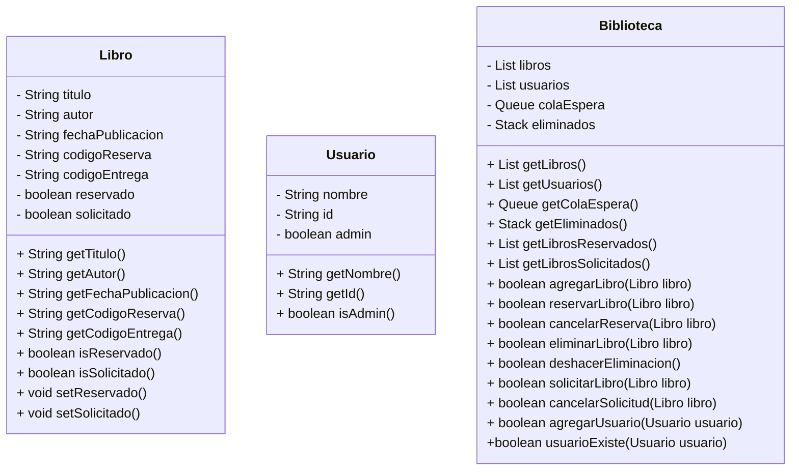

# Diagrama de clases para integrativa - Biblioteca

## Descripción

El siguiente diagrama de clases representa una biblioteca, con un log in para los usuarios estandar y para los administradores, donde los usuarios estandar pueden ver la disponibilidad de los libros (Lista en base de datos) y reservarlos (Cambiar su estado), los libros que se encuentran reservados (Estado del libro) no se pueden prestar, y la cola de espera (Queue) para poder reservar un libro cuando este se encuentre disponible. Los administradores pueden agregar libros a la base de datos, ver los libros que se encuentran en stock, ver los libros que se encuentran en cola de espera, ver los libros que se encuentran prestados

## Diagrama de clases

