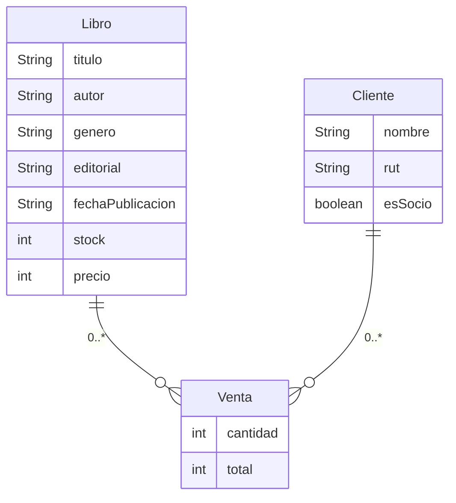

# Diagrama de clases para integrativa - Libreria

## Descripción

El siguiente diagrama de clases representa una librería, donde se pueden agregar libros, clientes y ventas. Los libros tienen un título, autor, género, editorial, fecha de publicación, stock y precio. Los clientes tienen un nombre, rut y si es socio o no. Las ventas tienen un cliente, un libro, una cantidad y un total. La librería tiene una lista de libros, clientes y ventas, y puede agregar libros, clientes y ventas, vender libros, mostrar el inventario y mostrar las ventas.

## Diagrama de clases


## Diagrama de base de datos



## Procesos en la base de datos

- Agregar libro
- Agregar cliente
- Agregar venta
- Vender libro
- Mostrar inventario
- Mostrar ventas
- Mostrar clientes
```
